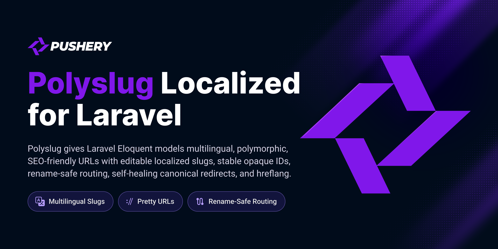

<p align="center">
  <a href="https://github.com/pushery/polyslug-for-laravel">
    
  </a>
</p>

# Polyslug

[](https://packagist.org/packages/pushery/polyslug-for-laravel)
[](https://packagist.org/packages/pushery/polyslug-for-laravel)
[](https://phpstan.org)
[](https://laravel.com/docs/pint)
[](LICENSE)

**Polymorphic, multilingual routable identity for Eloquent.** Pretty URLs that are
safe to expose, safe to rename, and correct across languages — with leak-free IDs,
self-healing canonical redirects, and hreflang built in.

```
/blog/laravel-routing-explained_aB3xK
      └──────── slug ─────────┘ └id─┘
   changeable, localized, SEO-friendly   stable, opaque, resolves the model
```

A slug should be free to change. A URL should never break. Those two goals usually
fight each other. Polyslug settles the fight by splitting a URL into two independent
parts — a **human-readable slug** (pretty, per-locale, editable) and a **stable
opaque identity** (an encoded token that resolves the model). Rename the slug all you
like: the identity still resolves, and old URLs redirect themselves to the new
canonical one.

---

## Why Polyslug?

- 🔒 **Leak-safe IDs by default.** URLs carry an encoded token, not `/pages/1523`. No
  exposed row counts, no enumerable primary keys. The encoder is pluggable — Sqids,
  UUID, ULID, or your own.
- ♻️ **Self-healing URLs.** Rename freely. A stale slug on a `GET`/`HEAD` request is
  `301`-redirected to the current canonical URL automatically — no redirect tables to
  hand-maintain, no dead links, no lost link equity.
- 🌍 **Multilingual with hreflang out of the box.** One slug per locale, and a
  reciprocal `hreflang` set (plus `x-default`) generated from the **same** resolver
  that builds your canonical URL — so they can never drift apart.
- 🧩 **Polymorphic routing.** Serve every content type — pages, articles, products —
  through a single `{type}/{polyslug}` route and one registry.
- 🧭 **Stable resolution.** Route-model binding decodes the identity, not the slug, so
  a mistyped or outdated slug still finds the right model (then redirects). An unknown
  or malformed token is a clean `404` — never a fuzzy match.
- 🏢 **Scoped uniqueness.** Uniqueness can be scoped per tenant, per locale, per
  category — whatever columns you name.
- 🗂️ **History, events & immutability.** Superseded slugs are kept so old URLs keep
  resolving; a `SlugChanged` event fires on every change; slugs can be frozen.
- ✅ **Serious about correctness.** PHPStan at `max`, 100% line + type coverage, and a
  mutation-tested suite that runs on SQLite, PostgreSQL, **and** MySQL 8.4.

## Table of contents

- [Requirements](#requirements)
- [Installation](#installation)
- [Quick start](#quick-start)
- [How it works](#how-it-works)
- [Making a model sluggable](#making-a-model-sluggable)
- [Leak-safe identity encoders](#leak-safe-identity-encoders)
- [Self-healing routes](#self-healing-routes)
- [Slug-only URLs (no id)](#slug-only-urls-no-id)
- [Multilingual slugs & hreflang](#multilingual-slugs--hreflang)
- [Polymorphic routing](#polymorphic-routing)
- [Scoped uniqueness](#scoped-uniqueness)
- [Transliteration](#transliteration)
- [History, events & immutability](#history-events--immutability)
- [Gone & superseded content](#gone--superseded-content)
- [Nested (hierarchical) slugs](#nested-hierarchical-slugs)
- [Sitemaps](#sitemaps)
- [Short links (`/go`)](#short-links-go)
- [Backfilling existing rows](#backfilling-existing-rows)
- [Recipes](#recipes)
- [Configuration](#configuration)
- [Diagnostics](#diagnostics)
- [Testing](#testing)

## Requirements

- PHP 8.4+
- Laravel 13+
- PostgreSQL, MySQL 8.4+, or SQLite. The uniqueness guarantees are enforced natively on
  each — a functional partial unique index on PostgreSQL/SQLite, equivalent generated key
  columns on MySQL — and the full suite runs against all three. So Polyslug works on
  Laravel Cloud (serverless Postgres + MySQL 8.4 LTS) with no extra configuration.

## Installation

```bash
composer require pushery/polyslug-for-laravel
```

The service provider registers itself through package discovery. Polyslug stores its
slugs in a `polyslug_slugs` table whose migration is registered automatically, so a
plain `migrate` is enough:

```bash
php artisan migrate
```

## Quick start

Mark a model as sluggable, and you are done — slugs generate on save:

```php
use Illuminate\Database\Eloquent\Model;
use Polyslug\Attributes\Polyslug;
use Polyslug\Concerns\HasPolyslug;
use Polyslug\Contracts\Sluggable;

#[Polyslug(source: 'title')]
class Page extends Model implements Sluggable
{
    use HasPolyslug;
}
```

Point a route at it and add the canonical-redirect middleware:

```php
use Illuminate\Support\Facades\Route;

Route::get('/pages/{page}', [PageController::class, 'show'])
    ->middleware('polyslug.canonical')
    ->name('pages.show');
```

That is the whole setup. Now:

```php
$page = Page::create(['title' => 'Laravel Routing Explained']);

route('pages.show', $page);   // → /pages/laravel-routing-explained_aB3xK

$page->update(['title' => 'A Deep Dive Into Laravel Routing']);
route('pages.show', $page);   // → /pages/a-deep-dive-into-laravel-routing_aB3xK

// The old URL still works — and 301-redirects to the new one:
// GET /pages/laravel-routing-explained_aB3xK  →  301  →  /pages/a-deep-dive-into-laravel-routing_aB3xK
```

## How it works

A route key is composed of two parts joined by an underscore:

```
laravel-routing-explained_aB3xK
└──────── slug ─────────┘ └id─┘
```

- The **slug** is generated from the source column(s), transliterated and normalized.
  It is what humans and search engines read — and it is free to change.
- The **id** is an opaque token produced by an [identity encoder](#leak-safe-identity-encoders)
  from the model's primary key. It is what actually resolves the model.

Because binding resolves the **id**, not the slug, an outdated or wrong slug still
finds the correct model. The `polyslug.canonical` middleware notices the slug no
longer matches and redirects to the canonical URL. Every slug a model has ever had is
stored in the `polyslug_slugs` table (the current one flagged `is_current`, the rest
kept as history), so **no URL you have ever published goes dead**.

Writes are concurrency-safe: demoting the old slug and inserting the new one happen in
one transaction, a partial unique index guarantees exactly one current slug per
(type, id, locale, scope), and a racing writer that claims the slug first simply causes
a bounded regenerate-and-retry (`polyslug.write.max_attempts`) — never a duplicate or a
slug-less model.

## Making a model sluggable

Add the `#[Polyslug]` attribute, the `HasPolyslug` trait, and the `Sluggable`
interface. The attribute declares which column(s) the slug is built from:

```php
#[Polyslug(source: 'title')]
class Page extends Model implements Sluggable
{
    use HasPolyslug;
}
```

Prefer to scaffold? Generate a pre-wired model:

```bash
php artisan make:polyslug Page
```

A slug is generated automatically when the model is saved. Changing the source
supersedes the old slug, keeping the previous one as history.

All attribute options:

| Option | Default | Description |
|---|---|---|
| `source` | — | Column(s) the slug is built from (`string` or `array`; arrays join with a space). |
| `separator` | `'-'` | Word separator within the slug. |
| `transliterate` | `Simple` | `TransliterationProfile::Simple` (ü→u) or `Din` (ü→ue). |
| `maxLength` | `null` | Trim the slug to at most this many characters (never mid-separator). |
| `unique` | `true` | Append `-2`, `-3`, … on a collision. Set to `false` to keep the slug as-is (no suffix) — it must then be collision-free within its `(type, locale, scope)`, or generation throws `Polyslug\Exceptions\SlugCollision`. |
| `scope` | `null` | Column(s) that scope uniqueness (e.g. `tenant_id`). |
| `reserved` | `[]` | Slugs that may never be assigned (matched case-insensitively). |
| `immutable` | `false` | Freeze the slug after first generation (see [below](#history-events--immutability)). |
| `encoder` | *(global)* | Override the [identity encoder](#leak-safe-identity-encoders) for this model only (a fully-qualified encoder class). |
| `onDelete` | `'keep'` | On soft-delete, `'keep'` reserves the slug; `'release'` frees it for reuse. A hard/force delete always cascades the slug rows. |
| `emptyFallback` | `'id-only'` | When the source has no sluggable characters (a CJK/emoji-only title), `'id-only'` stores an empty slug so the URL is just `_{id}` and the save never fails; `'throw'` raises `CouldNotGenerateSlug`. |
| `encoderOptions` | `[]` | Per-model `SqidsEncoder` options (`alphabet`, `min_length`) — a dedicated token space for this model. Ignored unless the effective encoder is `SqidsEncoder`. |
| `unicode` | `'ascii'` | `'native'` keeps Unicode letters/numbers (Chinese, Cyrillic, Greek, accented Latin) instead of ASCII-transliterating them away — for non-Latin markets. Slugs are lower-cased at generation so the case-insensitive unique index behaves identically on PostgreSQL, SQLite, and MySQL. |

App-wide reserved slugs (merged with each model's `reserved`) live in
`polyslug.reserved.global` — use it so generated slugs never shadow sensitive words like
`login`, `admin`, or `api`. Set `polyslug.reserved.from_routes` to `true` to additionally
reserve every registered route's path, so a slug can never collide with a real route.

Useful methods on a sluggable model:

```php
$page->currentSlug();          // "a-deep-dive-into-laravel-routing"
$page->currentSlug('de');      // the German current slug, or null
$page->getRouteKey();          // "a-deep-dive-into-laravel-routing_aB3xK"
$page->slugLocales();          // ['en', 'de']
$page->slugHistory();          // superseded slugs, newest first
$page->setSlug('de', 'Titel'); // set/override a locale's slug explicitly
```

### Dynamic (per-tenant) configuration

For rules that vary at runtime — per-tenant reserved words, a per-environment encoder —
implement `Polyslug\Contracts\ConfiguresPolyslug` and return a `PolyslugConfig` from
`polyslug()`. It is resolved fresh on every use and takes precedence over the
`#[Polyslug]` attribute:

```php
use Polyslug\Contracts\ConfiguresPolyslug;
use Polyslug\PolyslugConfig;

class Page extends Model implements Sluggable, ConfiguresPolyslug
{
    use HasPolyslug;

    public function polyslug(): PolyslugConfig
    {
        return PolyslugConfig::fromAttribute(new Polyslug(
            source: 'title',
            reserved: currentTenant()->reservedSlugs(),
        ));
    }
}
```

## Leak-safe identity encoders

The token that stands in for the primary key is produced by a pluggable
`IdentityEncoder`. The default `SqidsEncoder` obfuscates the key (it is **obfuscation,
not security**) — swap it for a leak-free encoder when row count or creation time must
stay private:

```php
// config/polyslug.php
'encoder' => \Polyslug\Encoders\UuidEncoder::class,
```

Need different schemes for different models? Override the encoder per model — the
global default stays in place, and one model opts into another scheme:

```php
#[Polyslug(source: 'username', encoder: \Polyslug\Encoders\UuidEncoder::class)]
class Profile extends Model implements Sluggable
{
    use HasPolyslug;
}
```

| Encoder | Key type | What the URL reveals |
|---|---|---|
| `SqidsEncoder` *(default)* | integer | approximate row count (obfuscated), no ordering |
| `UuidEncoder` | UUID | nothing (with a random UUIDv4) |
| `UlidEncoder` | ULID | creation time (ULIDs are time-ordered) |
| `RawIdEncoder` | integer | the raw primary key — for internal tooling only |
| `RandomTokenEncoder` | integer | nothing — an unguessable random token stored in `polyslug_tokens` (leak-free for integer keys) |

Non-canonical tokens (a wrong length, leading zeros, a re-encoded alias) resolve to a
clean `404` rather than silently pointing at the same record twice, so every record
has exactly one canonical URL. Implement `Polyslug\Contracts\IdentityEncoder` for a
custom scheme:

```php
interface IdentityEncoder
{
    public function encode(int|string $id): string;
    public function decode(string $token): int|string|null; // null → 404
}
```

**Migrating encoders.** Changing `polyslug.encoder` re-encodes every URL. List the
previous encoder in `polyslug.legacy_decoders` so old links keep resolving — the current
encoder is tried first, then each legacy decoder in order, and the canonical middleware
301s the resolved model to its new-format URL on the next visit:

```php
'encoder'         => RandomTokenEncoder::class,
'legacy_decoders' => [SqidsEncoder::class], // old Sqid URLs still resolve, then self-heal
```

## Self-healing routes

Bind a model as usual and add the canonical-redirect middleware. URL generation uses
the canonical route key automatically:

```php
Route::get('/pages/{page}', [PageController::class, 'show'])
    ->middleware('polyslug.canonical')
    ->name('pages.show');

route('pages.show', $page); // → /pages/my-title_aB3xK
```

Or let the `Route::polyslug()` macro wire `SubstituteBindings` and `polyslug.canonical`
in the correct order for you (a mis-ordered stack silently disables self-heal):

```php
Route::polyslug('/pages/{page}', [PageController::class, 'show'])->name('pages.show');
```

On a safe (`GET`/`HEAD`) request whose slug is stale, `polyslug.canonical` issues a
redirect (301 by default, configurable) to the canonical URL — preserving the query
string and rebuilding every route parameter. Non-sluggable segments and unsafe verbs
(`POST`, `PUT`, …) pass through untouched. Route-model binding resolves the model by
decoding the id; an unknown or malformed token yields a `404`, never a fuzzy match.

**Access control is your application's job.** By default binding resolves any row —
Polyslug does not own your tenant or publish state. Override `polyslugResolveQuery()`
to inject those scopes; a model outside the scope then resolves to a `404` that is
indistinguishable from a nonexistent one (no existence oracle), and this is enforced
uniformly across bound routes and the polymorphic resolver:

```php
use Illuminate\Database\Eloquent\Builder;

public function polyslugResolveQuery(Builder $query): Builder
{
    return $query->where('tenant_id', currentTenant()->id)->where('published', true);
}
```

`polyslugIsRoutable(?string $locale = null): bool` is the companion for output — return
`false` to keep an unpublished model (or a specific locale) out of your hreflang sets
and sitemaps.

## Slug-only URLs (no id)

Prefer `/blog/hello-world` over `/blog/hello-world_aB3xK`? Set `idLess: true` — the URL is
the slug alone, and resolution is by slug instead of by id:

```php
#[Polyslug(source: 'title', idLess: true)]
class Article extends Model implements Sluggable
{
    use HasPolyslug;
}
```

Polyslug keeps the id-less mode safe:

- A **current** slug resolves directly (no redirect).
- A **superseded** slug still resolves, then `301`s to the current URL — old links never die.
- A **retired** slug stays reserved, so it can never be reassigned to a different model
  (which would silently hijack an old URL).

Because the slug *is* the identity here, it must be unique per `(type, locale, scope)` —
choose sources that stay unique, and expect a `-2` suffix on genuine collisions.

## Multilingual slugs & hreflang

A model carries a slug per locale. Set a translated slug explicitly:

```php
$page->setSlug('de', 'Hallo Welt'); // store the German slug
$page->currentSlug('de');           // "hallo-welt"
$page->slugLocales();               // ['en', 'de']
```

Build the localized URLs and the hreflang set from a single resolver — the canonical
URL and the hreflang alternates come from the **same source**, so they can never
disagree:

```php
$resolver = fn (string $locale, string $key) => route('pages.show', [
    'locale' => $locale,
    'page' => $key,
]);

$page->polyslugUrls($resolver);  // ['en' => 'https://…/en/…', 'de' => 'https://…/de/…']
$page->hreflangLinks($resolver); // the above + a reciprocal, self-referential 'x-default'
```

Render the tags in the page `<head>` — on every localized version, so the set stays
reciprocal — and the `<xhtml:link>` alternates inside a sitemap `<url>` entry:

```blade
{{ $page->hreflangTags($resolver) }}
{{ $page->sitemapAlternateTags($resolver) }}

{{-- or the directive shorthand for the hreflang tags: --}}
@polyslugHreflang($page, $resolver)
```

By default `x-default` points at the application's fallback locale (with a graceful
fallback to the first available locale). Override it per call:
`$page->hreflangLinks($resolver, 'de')`.

**Locale-aware routing.** On a `/{locale}/…` route, set `polyslug.locale.source = 'route'`
so the canonical-redirect middleware compares against — and redirects to — the slug for
the locale *in the URL*, even when the app locale differs (in CLI, queues, or before a
locale-setting middleware runs). This is what prevents wrong-language redirect loops.
When you build URLs off a request cycle (sitemaps, queued jobs, feeds), use
`$model->polyslugRouteKeyForLocale($locale)` — it never reads the ambient app locale. If a
locale has no slug, `polyslug.locale.missing` chooses between falling back to the default
locale's slug (`fallback`, default) or emitting a slug-less id-only key (`id-only`).

## Polymorphic routing

Serve every content type through one route. Register the type map:

```php
// config/polyslug.php
'types' => [
    'page' => \App\Models\Page::class,
    'article' => \App\Models\Article::class,
],
```

Then bind a `{type}/{polyslug}` route — the `{polyslug}` parameter resolves to the
right model based on `{type}` (an unknown type or unresolvable slug yields a `404`),
and self-healing still applies:

```php
Route::get('/{type}/{polyslug}', [ContentController::class, 'show'])
    ->middleware('polyslug.canonical');
```

Or resolve manually:

```php
$model = app(\Polyslug\PolyslugResolver::class)->resolve('page', 'my-title_aB3xK');
```

## Scoped uniqueness

Scope uniqueness to any column(s) — most commonly a tenant — so two tenants can each
own the same slug without collision:

```php
#[Polyslug(source: 'title', scope: 'tenant_id')]
class Page extends Model implements Sluggable
{
    use HasPolyslug;
}
```

Uniqueness is always isolated per locale and per model type as well, so a German slug
never collides with an English one, and a `Page` never collides with an `Article`.

## Transliteration

Non-ASCII source text is folded to a URL-safe slug. Pick the profile that matches your
audience:

```php
#[Polyslug(source: 'title', transliterate: TransliterationProfile::Din)]
```

| Profile | `Größe` → | `Über` → |
|---|---|---|
| `Simple` *(default)* | `grosse` | `uber` |
| `Din` | `groesse` | `ueber` |

## History, events & immutability

`Polyslug\Events\SlugChanged` fires whenever a current slug is created or changed
(`previous` is `null` on first generation) — a natural hook for cache busting, search
reindexing, or sitemap regeneration:

```php
use Polyslug\Events\SlugChanged;

Event::listen(function (SlugChanged $event) {
    // $event->model, $event->locale, $event->slug, $event->previous
});
```

Enable `polyslug.analytics.enabled` to also dispatch `Polyslug\Events\SlugRedirected` on
every self-healing redirect (the requested key, canonical URL, model, locale, and status)
— a fire-and-forget hook for measuring link rot, warming a cache, or purging a CDN.

Freeze a model's slug after its first generation so later edits to the source never
move it — ideal for permalinks:

```php
#[Polyslug(source: 'title', immutable: true)]
```

Superseded slugs are kept (so old URLs keep resolving) and read newest-first with
`$model->slugHistory()`.

## Gone & superseded content

Content that permanently moved or was removed should not become a soft-404 that loses
its search ranking. Two model hooks, honored by the `polyslug.canonical` middleware
(ahead of same-model self-heal), handle it:

```php
use Polyslug\Contracts\Sluggable;

// Discontinued item → 301 to its replacement, preserving locale and link equity:
public function polyslugSupersededBy(): ?Sluggable
{
    return $this->replacement; // any Sluggable model, or null
}

// Permanently removed → 410 Gone (a fast de-index signal; status via polyslug.gone.status):
public function polyslugIsGone(): bool
{
    return $this->trashed();
}
```

## Nested (hierarchical) slugs

Compose ancestor slugs into the URL path — `/electronics/phones/iphone_TOKEN`. Override
`polyslugParent()` to point at the parent, and scope uniqueness on the parent key so the
same segment can repeat under different parents:

```php
#[Polyslug(source: 'name', scope: 'parent_id')]
class Category extends Model implements Sluggable
{
    use HasPolyslug;

    public function polyslugParent(): ?Sluggable
    {
        return $this->parent_id === null ? null : self::find($this->parent_id);
    }
}
```

Route it with a catch-all segment:

```php
Route::polyslug('/{category}', [CategoryController::class, 'show'])->where('category', '.*');
```

The path is computed from the ancestors' *current* slugs, so renaming or reparenting an
ancestor changes the URL and the canonical middleware 301s the stale one — no cascade or
stored path to maintain. Recursion is depth-bounded against accidental parent cycles.

## Sitemaps

Generate an XML sitemap with reciprocal `hreflang` alternates for your sluggable models.
Bind a `PolyslugUrlResolver` (the package can't know your URL structure) and register the
types:

```php
use Polyslug\Contracts\PolyslugUrlResolver;
use Polyslug\Contracts\Sluggable;

$this->app->bind(PolyslugUrlResolver::class, fn () => new class implements PolyslugUrlResolver
{
    public function url(Sluggable $model, string $locale): string
    {
        return route('pages.show', ['locale' => $locale, 'page' => $model->polyslugRouteKeyForLocale($locale)]);
    }
});
```

```php
// config/polyslug.php
'sitemap' => ['types' => [\App\Models\Page::class, \App\Models\Article::class]],
```

```bash
php artisan polyslug:sitemap --path=public/sitemap.xml
```

It streams rows (a large table never loads into memory) and includes only routable
models and locales — anything you hide via `polyslugIsRoutable()` stays out.

## Short links (`/go`)

A stable short URL per model + locale that always `301`s to the *current* canonical URL,
so a printed or QR-coded link survives every slug rename. Route the shipped controller
and mint a token:

```php
use Polyslug\Http\Controllers\ShortLinkController;

Route::get('/go/{token}', ShortLinkController::class);
```

```php
$token = $page->shortLink();   // stable per (model, locale)
url('/go/'.$token);            // → 301 → the model's current canonical URL
```

It builds the target with the same bound [`PolyslugUrlResolver`](#sitemaps) the sitemap
uses; an unknown token — or a model that no longer exists — is a clean `404`.

## Backfilling existing rows

Generate the current slug for a model whose rows predate Polyslug:

```bash
php artisan polyslug:backfill "App\Models\Page"

# or for a specific locale
php artisan polyslug:backfill "App\Models\Page" --locale=de

# or dispatch chunked queued jobs for a large table
php artisan polyslug:backfill "App\Models\Page" --queue --chunk=500
```

It streams rows in chunks and skips any that already have a current slug, so it is
safe to run repeatedly. With `--queue` the work is split into `Polyslug\Jobs\BackfillSlugsJob`
jobs (one per `--chunk`) dispatched across your queue workers.

## Recipes

Real-world wiring for common app shapes — each just combines features documented above.

### Multi-tenant SaaS — per-tenant slugs, no cross-tenant leak

```php
#[Polyslug(source: 'title', scope: 'tenant_id')] // 'hello' may repeat across tenants
class Doc extends Model implements Sluggable
{
    use HasPolyslug;

    public function polyslugResolveQuery(Builder $query): Builder
    {
        return $query->where('tenant_id', tenant()->id); // a slug resolves only within the tenant
    }
}
```

### News / magazine — multilingual, SEO-first

```php
#[Polyslug(source: 'headline', unicode: 'native')] // keep non-Latin headlines intact
class Article extends Model implements Sluggable
{
    use HasPolyslug;
}

$article->setSlug('de', 'Schlagzeile');
$article->hreflangTags($resolver); // reciprocal hreflang from the same resolver as the canonical URL
// php artisan polyslug:sitemap --path=public/sitemap.xml
```

### E-commerce — nested category paths

```php
#[Polyslug(source: 'name', scope: 'parent_id')] // same name allowed under different parents
class Category extends Model implements Sluggable
{
    use HasPolyslug;

    public function polyslugParent(): ?Sluggable
    {
        return $this->parent_id ? self::find($this->parent_id) : null; // /electronics/phones/iphone
    }
}
```

### Documentation / knowledge base — clean slug-only URLs

```php
#[Polyslug(source: 'title', idLess: true)] // /guide/installation — no _id suffix
class Guide extends Model implements Sluggable
{
    use HasPolyslug;
}
```

### Enumeration-sensitive data — unguessable URLs

```php
// config/polyslug.php
'encoder' => Polyslug\Encoders\RandomTokenEncoder::class, // token reveals no id, count, or order
```

### Sharing / QR codes — stable short links

```php
Route::get('/go/{token}', Polyslug\Http\Controllers\ShortLinkController::class);

$token = $product->shortLink(); // stable; /go/{token} 301s to the current canonical URL
```

## Configuration

Publish the configuration file to customize the encoder, Sqids alphabet, redirect
status, and the polymorphic type map:

```bash
php artisan vendor:publish --tag=polyslug-config
```

Every option in `config/polyslug.php` is documented inline. To customize the migration
or the package views/translations, publish them too:

```bash
php artisan vendor:publish --tag=polyslug-migrations
php artisan vendor:publish --tag=polyslug-views
php artisan vendor:publish --tag=polyslug-lang
```

## Diagnostics

Verify the setup — the encoder config and the uniqueness-guaranteeing indexes — at any
time:

```bash
php artisan polyslug:doctor
```

It exits non-zero if the configured encoder (or a legacy decoder) isn't a valid
`IdentityEncoder`, or if a required unique index is missing (e.g. migrations never ran).

## Testing

```bash
composer test
```

Assert slug behavior in your own suite with the `InteractsWithPolyslug` trait:

```php
use Polyslug\Testing\InteractsWithPolyslug;

uses(InteractsWithPolyslug::class); // Pest — or `use InteractsWithPolyslug;` in a PHPUnit TestCase

$this->assertHasCurrentSlug($page, 'hello-world');
$this->assertSlugResolves(Page::class, $page->getRouteKey(), $page->id);
$this->assertSlugRedirects('/pages/old-slug_TOKEN', '/pages/new-slug_TOKEN');
$this->assertSlugNotResolvable(Page::class, 'bad_token');
```

## Security

Please review the [security policy](SECURITY.md) and report vulnerabilities
privately rather than opening a public issue.

## Built by Pushery

This package is built and maintained by [Pushery](https://www.pushery.com) — a
Berlin-based studio building Laravel applications, SaaS products, and open-source
tools.

Building a Laravel UI? [WireKit](https://wirekit.app), Pushery's open-source
Livewire component kit, gives you a polished component library out of the box.
Browse the rest of our work at [pushery.com](https://www.pushery.com).

## License

The MIT License (MIT). See [LICENSE](LICENSE) for details.
